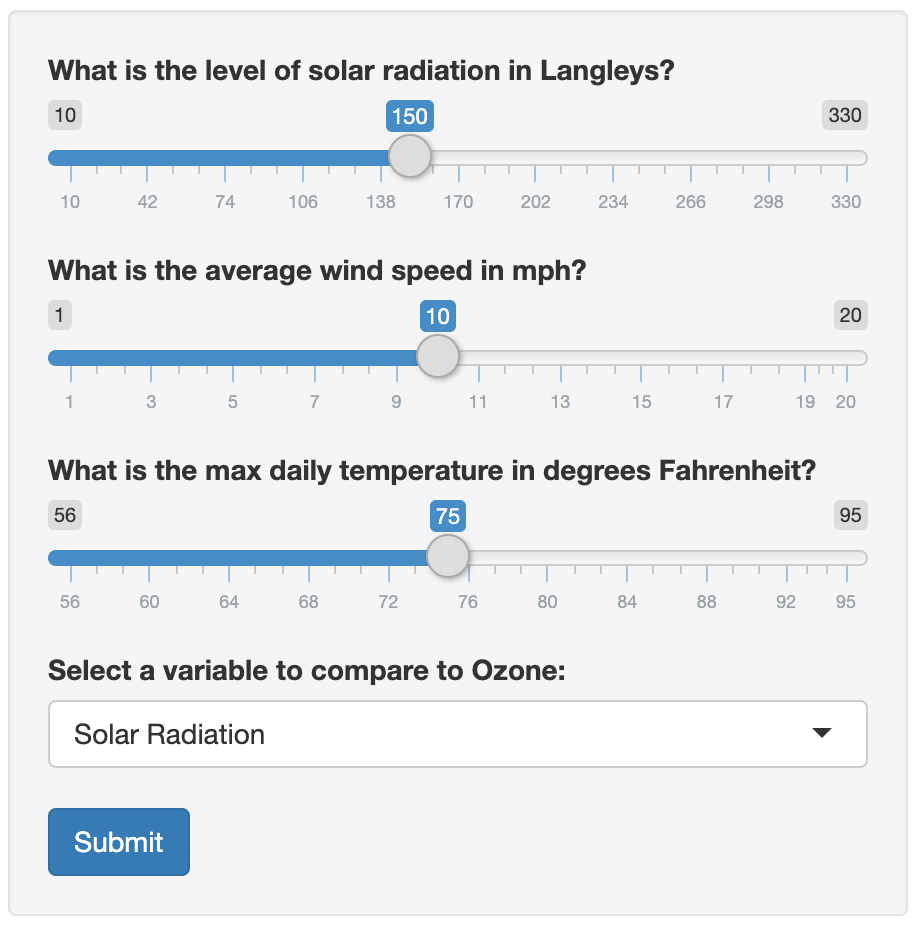

Predicting Air Quality Shiny App
========================================================
author: Jason Hooker
date: 4/11/2020
width: 1440
height: 900

Overview
========================================================

This app will allow users to predict ozone levels (the measure used to determine air quality) based on solar radiation levels, wind speed, and temperature values of their choice. 

### Purpose
The purpose of this application is to allow users to see the difference in predicted air quality when modeling on only one of the aforementioned variables versus accounting for all three. 

### Data
The data used in this application come from the dataset that comes preloaded in R. For more information on the dataset, see the link below.

https://www.rdocumentation.org/packages/datasets/versions/3.6.2/topics/airquality

User Input
========================================================



***

Users input values via the sliders and dropdown menu shown at left. They are able to set values for 
solar radiation, wind speed, and temperature, then must choose which variable they'd like to see
used in a linear model to predict ozone.

The input collected from the user is called on in reactive functions in the server.R file to predict ozone level based on the values from this input. Reactive functions are also used to plot the model of the selected varabile against ozone.

Modeling Code
========================================================

The code shown below contains the linear modeling functions used, assuming that the user chose solar radiation, as well as the reactive functions that predict ozone based on solar radiation alone and on all three variables together.


```r
solarModel <- lm(Ozone ~ Solar.R, data = airquality)
totalModel <- lm(Ozone ~ Solar.R + Wind + Temp, data = airquality)

solarPred <- reactive({
    solarInput <- input$sliderSolar
    predict(solarModel, newdata = data.frame(Solar.R = solarInput))
})
totalPred <- reactive({
    solarInput <- input$sliderSolar
    windInput <- input$sliderWind
    tempInput <- input$sliderTemp
    predict(totalModel, newdata =
                data.frame(Solar.R = solarInput,Wind = windInput, Temp = tempInput))
})
```

Results Plot
========================================================
left: 40%


***

The plot at right is displayed to the user after hitting submit, assuming they entered a value of 150 for solar radiation. Notice the point on the graph, which corresponds to the predicted ozone level of 37.7 from the solar radiation model.

The application also tells the user that using the all-inclusive model, the predicted ozone level is 35.2 (assuming set wind speed value of 10 and temperature value of 75). This value can change drastically when variables are altered. Users see here exactly how much predictions can be affected by including or excluding variables in a model.
